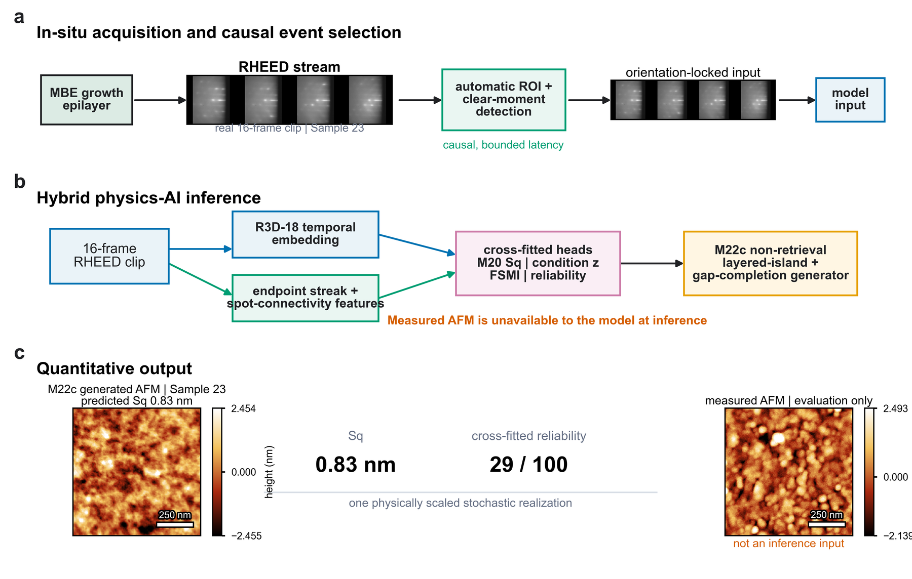
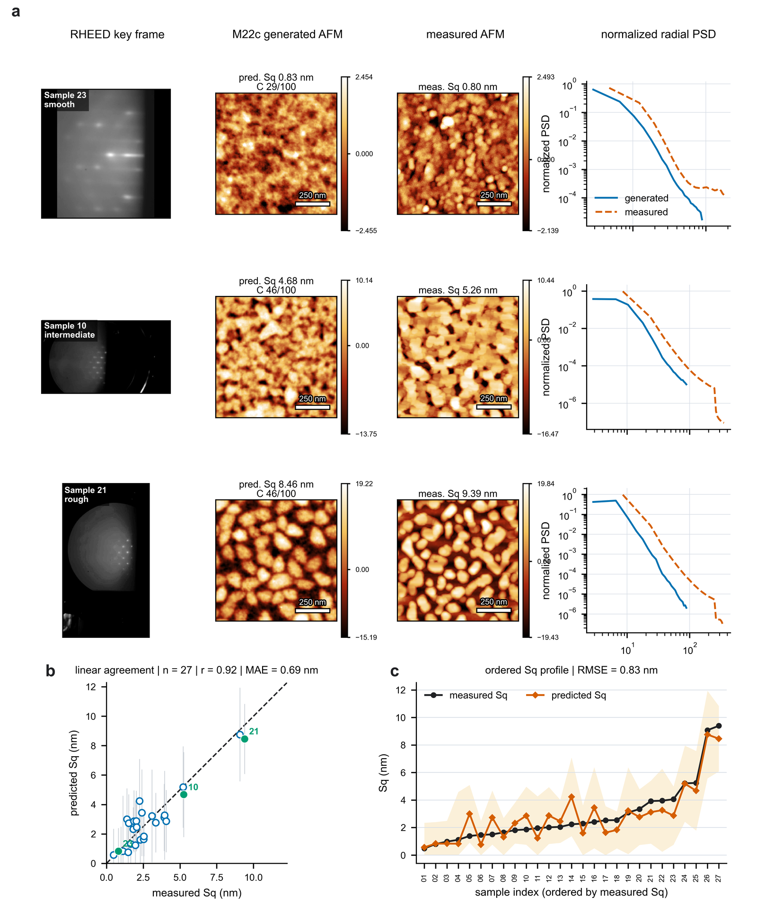

# MorphMBE M22

MorphMBE predicts ex-situ atomic-force-microscopy (AFM) morphology from an
in-situ reflection high-energy electron diffraction (RHEED) video. The M22
release combines automatic RHEED localization and causal clear-moment
selection, an M20 spot-connectivity-calibrated surface-roughness head, and an
M22c non-retrieval layered-island generator.



The public release is the minimal executable closure of the frozen M22
standalone. It includes the desktop UI, headless inference, quantitative result
tables, publication-figure source, deployment assets, and integrity tests. It
does not include raw RHEED/AFM measurements or multi-gigabyte experiment
archives.

## Frozen result

Strict outer leave-one-growth-out evaluation over 27 growth groups produced:

| Sq metric | Value |
|---|---:|
| Pearson r | 0.9234 |
| MAE | 0.6853 nm |
| RMSE | 0.8291 nm |
| 90% interval coverage | 1.000 |

Each held growth is excluded from all fitting in its fold. The Sq head and M22c
generator use no measured query AFM, image retrieval, or nearest-AFM copying at
inference. These results are retrospective method-development evidence, not a
prospective clinical or manufacturing validation.



## Installation

The frozen environment targets Python 3.12 and macOS Apple Silicon. CPU and
Apple MPS are supported; CUDA is not required.

```bash
git clone git@github.com:Solis03/MorphMBE.git
cd MorphMBE
uv sync --frozen --group dev
uv run python scripts/validate_release.py
```

The first inference may download the official torchvision R3D-18 weights.
Set `TORCH_HOME` to an existing cache for offline execution. No global Python
packages are modified.

## Run the application

Place RHEED videos under `data/raw/raw_RHEED/<sample-id>/`, or pass any video
path directly to the command-line predictor.

Desktop UI:

```bash
uv run morphmbe-ui --config configs/morphmbe_m22_realtime.json
```

Headless end-to-end prediction:

```bash
uv run morphmbe-predict \
  "data/raw/raw_RHEED/N6063/rampdown to 300C.MOV" \
  --sample-id 6063 \
  --config configs/morphmbe_m22_realtime.json \
  --output-dir artifacts/predictions/6063
```

The predictor writes `result.json`, `prediction.npz`, and PNG/PDF panels. The
NPZ contains the exact selected clips, key frame, unit-Sq morphology, physical
height map, Sq, FSMI, and confidence values.

## Publication figures

The figure builder emits 600 dpi PNG and LZW TIFF, vector PDF, editable SVG,
and CSV plot data. SVG output can be imported into Canva, Illustrator,
Inkscape, or PowerPoint.

```bash
uv run python scripts/build_nanoletters_m22_figure_package.py \
  --config configs/morphmbe_m22.json \
  --output artifacts/nanoletters_m22
uv run python scripts/validate_nanoletters_m22_figure_package.py \
  artifacts/nanoletters_m22
```

Full figure regeneration requires the private measurements and derived feature
tables at the paths documented in `configs/morphmbe_m22.json`. Frozen public
metrics and integrity tables are under `results/m22/`.

## Repository map

```text
assets/       Frozen lightweight deployment and training parameters
configs/      M22 generation and real-time application configurations
src/          Installable UI and inference package
analysis/     Algorithms required by the frozen model and figure builder
scripts/      Release, audit, UI capture, and figure commands
results/m22/  Frozen aggregate and per-growth evaluation tables
tests/        Model, UI, morphology, split, and release-integrity tests
docs/         Architecture, model card, methods, and reproducibility
```

Read [the architecture](docs/ARCHITECTURE.md), [model card](docs/MODEL_CARD.md),
[method history](docs/METHOD_DEVELOPMENT.md), and
[reproducibility guide](docs/REPRODUCIBILITY.md). The
[release verification](docs/RELEASE_VERIFICATION.md) records the frozen
standalone-to-release end-to-end comparison.

## Verification

```bash
uv run pytest -q
uv run ruff check .
uv run python scripts/validate_release.py
```

The release validator checks model identity, asset hashes, the exact 27-growth
cohort, strict outer-LOO leakage boundaries, frozen Sq metrics, the 6063
end-to-end fixture, tracked-file size, and absence of historical artifact
trees. Raw data are never modified by these commands.
