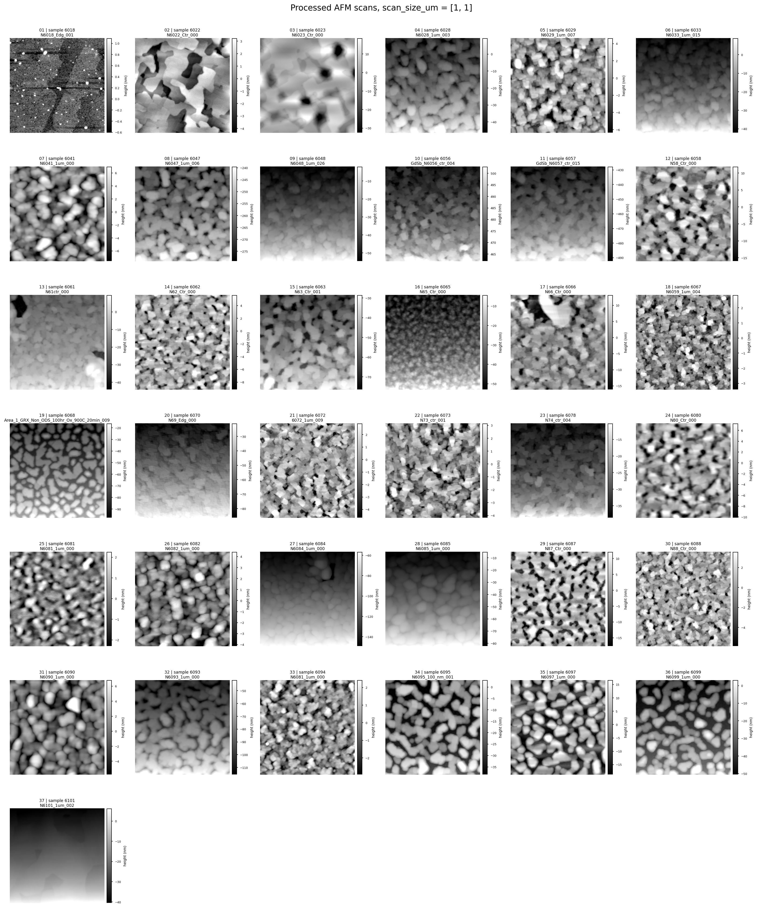
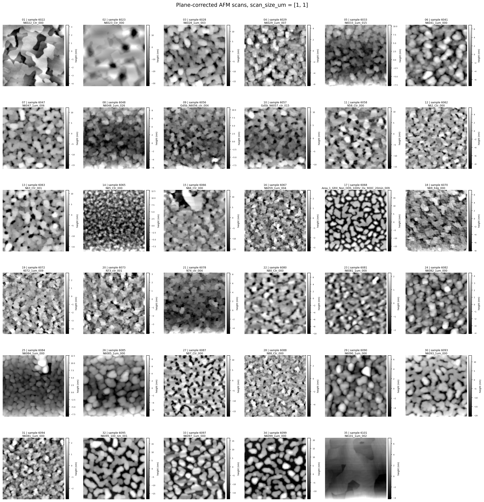

# RHEED2Morph

RHEED2Morph is a research pipeline for preparing paired RHEED and AFM data for
morphology prediction. The current code focuses on reproducible data staging:
pairing samples, extracting AFM height maps, and writing summary metadata that
can support later modeling experiments.

This repository is an initial feasibility demo. Any generated model output or
analysis from the current pipeline should be treated as exploratory, not as a
final scientific result.


## AFM Overview Figures

The pipeline also renders two 1 x 1 um AFM overview figures. Each sample appears
at most once in each grid, and each subplot includes its own height colorbar in
nm.

Processed AFM height maps:



Plane-corrected AFM height maps:



## Repository Structure

```text
.
├── data/
│   ├── README.md
│   └── manifests/
│       └── README.md
├── notebooks/
├── outputs/
├── reports/
├── scripts/
│   ├── batch_extract_afm_by_sample.py
│   ├── inspect_afm_raw.py
│   └── make_pairs.py
├── src/
│   └── rheed2morph/
│       ├── afm/
│       ├── pairing/
│       ├── pipeline/
│       ├── rheed/
│       └── utils/
├── tests/
├── run_pipeline.py
├── pyproject.toml
└── uv.lock
```

Large raw and generated files are intentionally excluded from git. Keep raw
inputs under `data/raw/`, generated pairs under `data/pair/`, processed arrays
under `data/processed_afm/`, and experiment artifacts under `outputs/`.

## Setup

```bash
uv sync
```

If you only need to run a single command without activating an environment, use
`uv run ...` as shown below.

## Basic Commands

Create paired AFM/RHEED folders:

```bash
uv run python scripts/make_pairs.py \
  --afm_root data/raw/raw_AFM \
  --rheed_root data/raw/raw_RHEED \
  --pair_root data/pair
```

Inspect one AFM raw file:

```bash
uv run python scripts/inspect_afm_raw.py \
  --input data/pair/6022/AFM/N6022_Ctr_000 \
  --output_dir data/processed_afm
```

Batch extract AFM height maps:

```bash
uv run python scripts/batch_extract_afm_by_sample.py \
  --pair_root data/pair \
  --output_root data/processed_afm
```

Run the full pipeline, including AFM descriptor-to-image reconstruction:

```bash
uv run python run_pipeline.py
```

Run only the reconstruction experiments from existing `data/plane_corrected_afm/`:

```bash
uv run python run_pipeline.py recon
```

Preview the pipeline without modifying files:

```bash
uv run python run_pipeline.py --dry-run
```

## Tests

The smoke tests use the Python standard library test runner:

```bash
PYTHONPATH=src uv run python -m unittest discover -s tests
```

These tests verify package imports, expected data manifest layout, and basic
pipeline path configuration.
