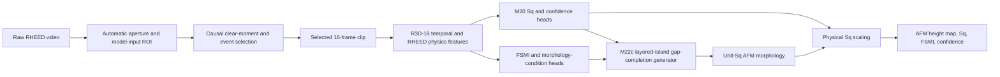

# Architecture

MorphMBE M22 has one inference path shared by the UI and command-line client.
The desktop application adds asynchronous replay, plotting, and session
recording; it does not implement a second model path.

## Runtime stages

1. `rheed2morph.rheed.automatic_roi_keyframe` samples the video and localizes
   full-lattice, physics, tracking, and audit regions in source-pixel
   coordinates.
2. `rheed2morph.realtime.selector` applies the causal event policy and returns
   retained clear moments. Per-sample 90-degree corrections for N6389/N6390
   occur before downstream image processing.
3. `rheed2morph.realtime.clips` constructs the selected-16 temporal input,
   physics input, and causal perturbation views.
4. `rheed2morph.realtime.model` loads the frozen deployment bundle, computes
   M20 spot-connectivity-calibrated Sq, FSMI, uncertainty, and the morphology
   condition, then calls the M22c renderer.
5. M22c combines the conditional spectral prior with finite elliptical islands,
   growth-stage layering, largest-gap nucleation, lateral coalescence, and
   roughness-aware blending. Its unit-Sq surface is scaled to the predicted Sq.
6. `rheed2morph.realtime.predict` serializes a headless result. The UI uses the
   same predictor through `PredictionWorker` and records event timelines via
   `SessionRecorder`.

## Model and data boundaries

- The deployment cohort contains 27 growth groups; 6081 is excluded.
- Each retrospective evaluation fold fits 26 growths and holds out one complete
  growth.
- Measured query AFM, AFM retrieval, and nearest-image copying are disabled at
  inference.
- AFM metrology uses the sample median of scan Sq after independent third-order
  polynomial flattening of each fast-scan line.
- `Rq_nm` remains in some frozen internal table keys for historical
  compatibility; the published areal roughness quantity is Sq in nanometers.

## Source ownership

| Path | Responsibility |
|---|---|
| `src/rheed2morph/realtime/` | Production inference, UI, workers, sessions |
| `src/rheed2morph/rheed/` | RHEED orientation, ROI, and visibility |
| `analysis/rheed_rough_island_redesign/` | M20 connectivity and M22 figures |
| `analysis/rheed_to_afm_*` | Frozen morphology algorithms required by M22 |
| `assets/models/` | Small frozen deployment/calibration objects |
| `results/m22/` | Auditable frozen retrospective results |

The release intentionally omits obsolete M1-M21 orchestration scripts and
multi-gigabyte development outputs while retaining modules referenced by the
serialized M22 bundle or publication builder.
